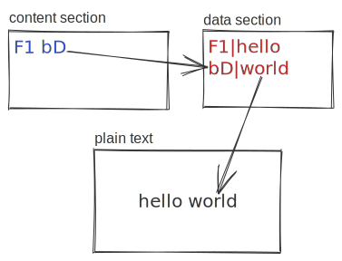

# Practice Set 04: Avert Dessert Disaster

## Overview

Alexander is prepping desserts for a party. His grandmother wrote down all of her pie recipes on her computer. But oh no! The computer that she wrote it on used a program called `CamEdit` which was discontinued in the 1980s, and Alexander's current computer cannot run `CamEdit`. So  `desserts.cmdt` is basically lost.

You do some reading and stumble across a poorly-rigged website straight out of the 1990s that tells you how the files work.

Apparently: a `.cmdt` file contains a **content section** that with ASCII letters, spaces, and newlines. Each letter sequence is comprised of two characters, for example:

```text
F1 bD
```

The rest is a **data section** showing how to convert the two-letter-words back into English. For example, the following:

```text
F1|hello
bD|world
```

... tells us that the `F1 bD` in the content section should be translated back to:

```
hello world
```

We will treat these as two files that should be interpreted in two ways. The "content section" is a list of words (or *tokens*) and "data section" is a mapping showing us how to map the tokens back to the plain text:

<picture>
  <source media="(prefers-color-scheme: dark)" srcset="./docs/content-data-plaintext-overview-dark.svg">
  <source media="(prefers-color-scheme: light)" srcset="./docs/content-data-plaintext-overview.svg">
  
</picture>

*Let's write a program to rescue the recipes!*

### 🥅 Goal

"Manipulating text files" shows up across unenumerable programming tasks.

We will practice using:

- `Lists[str]`: lists of strings
- `List[List[str]]`: lists of lists of strings
- `Dict[str, str]`: dictionaries mapping strings to strings
- [`.split()`](https://docs.python.org/3/library/stdtypes.html#str.split): splitting strings into lists
- [`.splitlines()`](https://docs.python.org/3/library/stdtypes.html#str.splitlines): splitting strings containing a variety of newline representations into a list
- [`.strip()`](https://docs.python.org/3/library/stdtypes.html#str.strip): removing trailing characters from strings
- [`open()`](https://docs.python.org/3/library/functions.html#open): asking our operating system to attach to a file and let us read/write to it
- ... alongside our earlier Python skills

### ✅ Checking solutions are correct

We've included a `test_submission.py` with unit tests to help check whether functions are meeting expectations.

```console
$ python3 test_submission.py
..................
----------------------------------------------------------------------
Ran 18 tests in 0.005s

OK
```

### 🧑‍🎓 What to submit?

Nothing! Practice making incremental commits as you progress, and we will grade the final commit created & pushed before the deadline.

> **Tip**: Branching is optional on this assignment, but we will always recommend practicing your branch + commit + merge strategy!

## Practice Problems

### PS-04-01

Inspect the `data/` directory, which contains directories for the `desserts`, `simple`, and `four_words` (the last two may be helpful when debugging):

```text
data/
├── desserts/
│  ├── desserts.content-cmdt
│  └── desserts.data-cmdt
├── four_words/
│  ├── four_words.content-cmdt
│  └── four_words.data-cmdt
└── simple/
   ├── simple.content-cmdt
   └── simple.data-cmdt
```

Write a function `load_content_section(file_name: str) -> list[list[str]]` that takes a file (or a path to a file) and returns a list of strings representing that files content.

For example the `data/four_words/four_words.content-cmdt` file contains:

```text
ab cd ef

gh
```

Loading this file should return a list-of-lists like:

```python
>>> load_content_section("data/four_words/four_words.content-cmdt")
[['ab', 'cd', 'ef'], [], ['gh']]
```

### ✅ Tests

```console
python3 test_submission.py PS_04_01
```

---

### PS-04-02

Now we need to write `load_data_section(file_name: str) -> dict[str, str]` to read from a file and load the content into a dictionary.

For example, `data/four_words/four_words.data-cmdt` contains:

```text
ab|does
cd|this
ef|work
gh|thanks
```

Loading from this file should return a dictionary mapping everything to the left of the pipe `|` with the stuff on the right side of the pipe:

```python
>>> load_data_section("data/four_words/four_words.data-cmdt")
{'ab': 'does', 'cd': 'this', 'ef': 'work', 'gh': 'thanks'}
```

### ✅ Tests

```console
python3 test_submission.py PS_04_02
```

---

### PS-04-03

Let's write a more user-friendly interface around the previous two functions.

`load_cmdt(file_path: str)` should take the path to a `cmdt` content and data section (e.g. `four_words`, `desserts`, `simple`) and return the content and data.

The file path parameter should be similar to this:

```python
>>> content, data = load_cmdt("data/four_words/four_words")
>>> content
[['ab', 'cd', 'ef'], [], ['gh']]
>>> data
{'ab': 'does', 'cd': 'this', 'ef': 'work', 'gh': 'thanks'}
```

<details>
<summary><strong>Hint #1</strong>: Don't repeat yourself!</summary>

> The definition of `load_cmdt` should use `load_content_section` and `load_data_section`.

</details>

<details>
<summary><strong>Hint #2</strong>: Returning multiple values from a function</summary>

> Imagine we have a function like:
>
> ```python
> def foo():
>     return 1, 2
> ```
>
> Returning two values from a function amounts to returning a tuple, which we can annotate as:
>
> ```python
> def foo() -> tuple[int, int]:
>     return 1, 2
> ```
>
> If we want to be pedantic, we could add parentheses to make it more obvious that the function returns a tuple like `(1, 2)`, but this is not necessary:
>
> ```python
> def foo() -> tuple[int, int]:
>     return (1, 2)
> ```
>
> When we call this function, we can immediately apply *tuple unpacking* to assign the values to variables:
>
> ```python
> >>> left, right = foo()
> >>> left
> 1
> >>> right
> 2
> ```

</details>

### ✅ Tests

```console
python3 test_submission.py PS_04_03
```

---

### PS-04-04

`cmdt_to_plaintext` should take a list-of-list-of-strings representing the *content* section and the dictionary-of-strings-to-strings representing the *data* section and produce a string representing the plaintext:

```python
>>> plaintext = cmdt_to_plaintext([['ab', 'cd', 'ef'], [], ['gh']], {'ab': 'does', 'cd': 'this', 'ef': 'work', 'gh': 'thanks'})
>>> print(plaintext)
does this work

thanks
```

> **Hint**: This should *return* a string, simply *printing* inside the function will not receive full credit.

### ✅ Tests

```console
python3 test_submission.py PS_04_04
```

---

### PS-04-05

There's a feature we really need now: an *index* informing us which recipes are listed in the file.

Let's write one more function. `build_list_of_recipes` should take the plaintext string output by `cmdt_to_plaintext`, and should return a list of the recipes.

```python
>>> content, data = load_cmdt("data/desserts/desserts")
>>> plaintext = cmdt_to_plaintext(content, data)
>>> print(build_list_of_recipes(plaintext))
['pie crust recipe', 'cherry pie recipe', 'pecan pie', 'spiced rum pecan pie', 'sugar creme pie', 'fruit pie', 'peach pie', 'peach pie', 'peach pie', 'key lime pie']
```

<details>
<summary><strong>Hint #1:</strong> Sometimes we need to write code to help us analyze a problem</summary>

> Instead of scrolling up and down in the terminal, send the output to a file and analyze the problem for patterns:
>
> ```bash
> python3 submission.py > recipes.txt
> ```
>
> You could also accomplish this in Python with a little helper function:
>
> ```python
> def write_plaintext_recipes_to_file():
>     content, data = load_cmdt("data/desserts/desserts")
>     plaintext = cmdt_to_plaintext(content, data)
>
>     with open("recipes.txt", "w") as fh:
>         fh.write(plaintext)
> ```
>
> Knowing that the recipes have titles like: "pie crust recipe", "cherry pie recipe", etc., is there some common pattern that all titles have in common?

</details>

<details>
<summary><strong>Hint #2:</strong> Problem analysis</summary>

> Here's a version of the plaintext representation focusing on the part we care about: the titles.
>
> ```text
> -------------------------------------------------------------------------------
>
> pie crust recipe
>
> ...
>
> -------------------------------------------------------------------------------
>
> cherry pie recipe
>
> ...
> ```
>
> In other words: every recipe title has a long line before it.

</details>

### ✅ Tests

```console
python3 test_submission.py PS_04_05
```

---

### PS-04-06

Let's put the pieces together to get the recipes and titles back!

Un-comment the `if __name__ == "__main__"` lines at the bottom of your Python starter file with <kbd>^ Ctrl</kbd> + <kbd>/</kbd> or <kbd>⌘ Cmd</kbd> + <kbd>/</kbd>.

Running with the "Run Python File" button (triangle at the top right), or invoking from the terminal with

```bash
python3 submission.py
```

... should now run the entire program and print the recipes:

```console
$ python3 submission.py
-------------------------------------------------------------------------------

pie crust recipe

makes four double crust

six cups flour
two cups shortening
two teaspoons of salt
two eggs
three tablespoons of vinegar plus enough water to make one cup

cut together flour shortening and salt

...

refrigerate for two hours or until set
garnish with peel twists

-------------------------------------------------------------------------------
['pie crust recipe', 'cherry pie recipe', 'pecan pie', 'spiced rum pecan pie', 'sugar creme pie', 'fruit pie', 'peach pie', 'peach pie', 'peach pie', 'key lime pie']
```

### ✅ Tests

```console
python3 test_submission.py PS_04_06
```

Since everything should now be implemented, it's also a good time to re-run all the tests:

```console
python3 test_submission.py
```

---

## Rubric

- Code that runs without errors and meets all requirements will initially receive full points
- Code that does *not* run will receive a maximum of 50%
- Code will lose a point if it is not sufficiently commented. At a minimum: functions should have a short docstring explaining the function purpose, and code with non-obvious behavior should have an inline comment.
- Code that is *over-commented* will receive a maximum of 50%

| | Maximum Points | Commenting? | Functionality? |
| -----: | :----: | :----: | :-----: |
| PS_04_01 | 5 | 1 | 4 |
| PS_04_02 | 5 | 1 | 4 |
| PS_04_03 | 5 | 1 | 4 |
| PS_04_04 | 5 | 1 | 4 |
| PS_04_05 | 5 | 1 | 4 |
| PS_04_06 | 5 | 1 | 4 |
| |  |  |  |
| **Total** | **30** | **6** | **24** |
